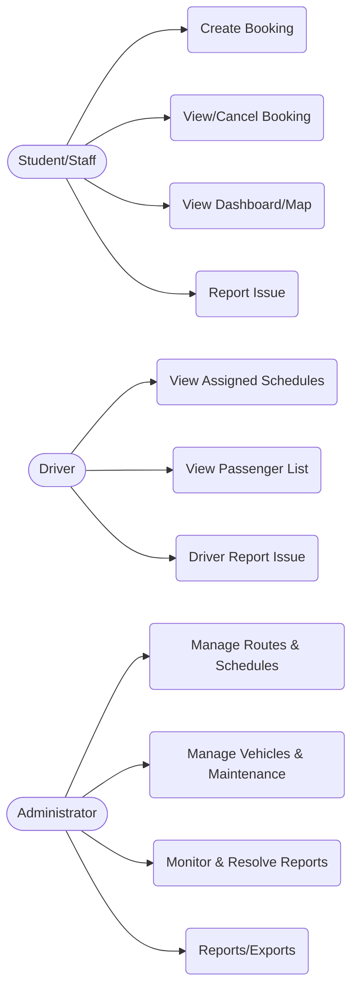
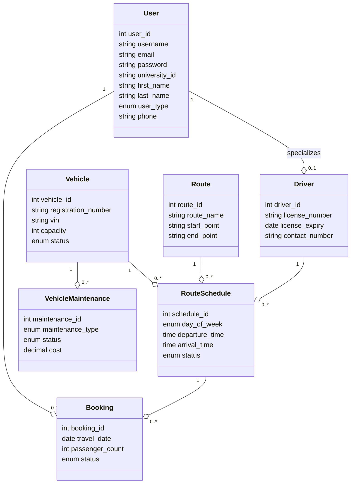

## TransPass UG — Database Schema, Use Cases, and UML

This document explains the implemented database schema, provides role-based use cases, and includes UML views describing the structure and interactions in TransPass UG.

### 1) Logical Data Model (ER/Schema Overview)

Core entities and relationships (crow’s foot notation described in text):

- Users (1) — (0..1) Drivers
  - A `driver` is a specialized user linked via `drivers.user_id → users.user_id` (CASCADE on delete)
- Users (1) — (0..N) Bookings
  - `bookings.user_id` references the passenger who placed the booking
- Routes (1) — (0..N) Route Schedules
  - `route_schedules.route_id` defines weekly/recurring trips for a route
- Vehicles (1) — (0..N) Route Schedules
  - Schedules may optionally have a vehicle; capacity used for seat calculations
- Drivers (1) — (0..N) Route Schedules
  - A schedule may assign a driver
- Bookings (N) — (1) Route Schedules
  - Each booking targets one schedule (`bookings.schedule_id`)
- Vehicles (1) — (0..N) Vehicle Maintenance
  - Maintenance records for a vehicle
- Driver Reports (N) — (1) Drivers; may refer to a Vehicle and Admin
- User Reports (N) — (1) Users; may refer to an Admin
- Routes (1) — (0..N) Route Coordinates
  - Polyline waypoints for map visualization

Tables implemented (key columns only):

- users(user_id PK, username UQ, email UQ, password, university_id UQ, first_name, last_name, user_type, phone, …)
- drivers(driver_id PK, user_id FK→users, license_number UQ, license_expiry, contact_number, assigned_vehicle_id FK→vehicles, …)
- vehicles(vehicle_id PK, registration_number UQ, vin UQ, capacity, status, …)
- routes(route_id PK, route_name, start_point, end_point, distance, estimated_duration, status)
- route_coordinates(coordinate_id PK, route_id FK→routes, latitude, longitude, sequence_order)
- route_schedules(schedule_id PK, route_id FK→routes, vehicle_id FK→vehicles, driver_id FK→drivers, day_of_week, departure_time, status, available_seats, max_capacity)
- bookings(booking_id PK, user_id FK→users, route_id FK→routes, schedule_id FK→route_schedules, travel_date, passenger_count, status, vehicle_id FK→vehicles, driver_id FK→drivers)
- driver_reports(report_id PK, driver_id FK→drivers, vehicle_id FK→vehicles?, admin_id FK→users?, issue_type, urgency, status)
- user_reports(report_id PK, user_id FK→users, admin_id FK→users?, issue_type, urgency, status)
- password_resets(id PK, user_id FK→users, token, expires_at)
- vehicle_maintenance(maintenance_id PK, vehicle_id FK→vehicles, maintenance_type, status, cost, dates)
- Views: driver_assignments, passenger_bookings (reporting and joins)

Indexes implemented (performance):
- Bookings: `idx_booking_user`, `idx_booking_route`, `idx_booking_schedule`, `idx_booking_date`, `idx_booking_status`
- Drivers: `idx_driver_license`, license_number unique
- Routes: `idx_route_name`
- Vehicles: registration_number unique + index, VIN unique

Integrity constraints (security and correctness):
- Foreign keys on all cross-table references with cascades where appropriate
- Enum-constrained statuses and types to standardize workflow states
- Server-side prepared statements to prevent SQL injection

### 2) Role Use Cases

High-value use cases by role and their main flows.

- Student/Staff (User)
  - UC1: Search/Create Booking → select route, date, schedule → confirm booking
  - UC2: View/Cancel Booking → list bookings, open detail, cancel if policy allows
  - UC3: View Dashboard/Map → see upcoming trips and route map
  - UC4: Report Issue → submit `user_reports` with urgency and type

- Driver
  - UC5: View Assigned Schedules → `driver-dashboard.php`/`driver-schedule.php`
  - UC6: View Passenger List → per schedule via bookings
  - UC7: Report Operational Issue → `driver_reports`

- Administrator
  - UC8: Manage Routes & Schedules → CRUD routes, assign vehicles/drivers
  - UC9: Manage Vehicles & Maintenance → vehicles and `vehicle_maintenance`
  - UC10: Monitor and Resolve Reports → triage `user_reports` and `driver_reports`
  - UC11: Reporting/Exports → via views `driver_assignments` and `passenger_bookings`

Mermaid use case diagram (roles to core use cases):



### 3) UML Structural View

Class-level (persistence model) relationships simplified:



### 4) How the App Uses the Schema

- Booking creation checks schedule capacity and creates a `bookings` row. Availability is shown by combining `route_schedules.max_capacity` and current bookings for the selected date.
- Dashboards query recent `bookings` joined with `routes`, `route_schedules`, `vehicles`, and `drivers` for context.
- Admin panels manage `routes`, `route_schedules`, `vehicles`, `drivers` and derive operations data via the two SQL views.
- Leaflet maps consume `route_coordinates` to draw polylines/markers.
- Reports modules write to `user_reports` and `driver_reports` for auditing and follow-up.

### 5) Normalization and Data Quality

- Third Normal Form targeted: attributes depend on primary keys and not on derived/transient data.
- Reference and status values are constrained via enums and foreign keys.
- Time-based fields (`travel_date`, `departure_time`, `arrival_time`) separate planning (schedule) from execution (booking date).

### 6) Security & Constraints Alignment

- Prepared statements in PHP for all write operations; email/HTML sanitized on output.
- FKs ensure no orphan bookings, schedules, or maintenance records.
- Unique constraints on registration numbers, VIN, emails, usernames, and license numbers prevent duplication.

### 7) Example Analytical Queries

- Seat utilization by schedule/date:
```sql
SELECT rs.schedule_id, rs.day_of_week, rs.departure_time,
       rs.max_capacity,
       COALESCE(SUM(b.passenger_count),0) AS booked
FROM route_schedules rs
LEFT JOIN bookings b ON b.schedule_id = rs.schedule_id AND b.status IN ('Pending','Confirmed')
WHERE rs.route_id = ? AND b.travel_date = ?
GROUP BY rs.schedule_id;
```

- Driver workload this week:
```sql
SELECT d.driver_id, d.first_name, d.last_name, COUNT(rs.schedule_id) trips
FROM drivers d
JOIN route_schedules rs ON rs.driver_id = d.driver_id
WHERE rs.day_of_week IN ('Monday','Tuesday','Wednesday','Thursday','Friday')
GROUP BY d.driver_id;
```

### 8) Diagrams Rendering

The Mermaid blocks above render in compatible Markdown viewers. For slides, export the diagrams to images or embed using a Mermaid plugin.


